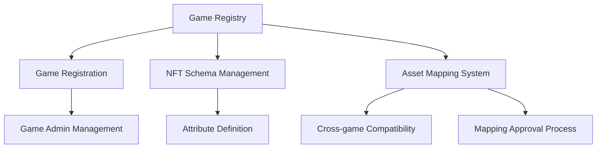

# GameWeave NFT Interoperability Platform

A unified ecosystem enabling cross-game NFT interoperability, asset transfers, and value preservation across multiple blockchain gaming environments.

## Overview

GameWeave creates a standardized protocol that allows NFT assets to maintain their utility and value across different gaming environments. The platform enables:

- Cross-game NFT compatibility and transfers
- Standardized asset attribute mapping
- Seamless integration for game developers
- True digital asset ownership for players
- Unified gaming ecosystem

## Architecture

GameWeave is built around a central registry system that manages game registrations, NFT attribute schemas, and cross-game asset mappings.



### Core Components

1. **Game Registry**: Central database of all registered games
2. **Admin System**: Multi-level administration for games and platform
3. **Schema Management**: NFT attribute standardization
4. **Asset Mapping**: Cross-game attribute translation system

## Contract Documentation

### gameweave-registry.clar

The core contract managing the GameWeave ecosystem.

#### Key Features

- Game registration and management
- NFT attribute schema definition
- Cross-game asset mapping
- Multi-level administrative control

#### Access Control

- Registry Admin: Platform-level administrative control
- Game Admins: Per-game administrative capabilities
- Game Developers: Automatic admin rights for their games

## Getting Started

### Prerequisites

- Clarinet
- Stacks wallet for deployment
- NFT contract for game assets

### Basic Usage

1. Register a game:
```clarity
(contract-call? .gameweave-registry register-game
    "game-id"
    "Game Name"
    "https://game.com"
    "Game description"
    'ST1PQHQKV0RJXZFY1DGX8MNSNYVE3VGZJSRTPGZGM.game-assets)
```

2. Set NFT schema:
```clarity
(contract-call? .gameweave-registry set-nft-schema
    "game-id"
    (list "strength" "speed" "level")
    u1)
```

3. Create asset mapping:
```clarity
(contract-call? .gameweave-registry set-asset-mapping
    "source-game"
    "target-game"
    (list {
        source-attr: "strength",
        target-attr: "power",
        transform-function: none
    })
    "{\"conversion_rate\": 1}")
```

## Function Reference

### Administrative Functions

```clarity
(set-registry-admin (new-admin principal))
(add-game-admin (game-id (string-ascii 64)) (admin principal))
(remove-game-admin (game-id (string-ascii 64)) (admin principal))
```

### Game Management

```clarity
(register-game (game-id (string-ascii 64)) (name (string-ascii 128)) (website (string-utf8 256)) (description (string-utf8 1024)) (asset-contract principal))
(update-game-info (game-id (string-ascii 64)) (name (string-ascii 128)) (website (string-utf8 256)) (description (string-utf8 1024)) (asset-contract principal) (active bool))
```

### Asset Mapping

```clarity
(set-asset-mapping (source-game (string-ascii 64)) (target-game (string-ascii 64)) (attribute-map (list 20 {...})) (conversion-rules (string-utf8 1024)))
(approve-asset-mapping (source-game (string-ascii 64)) (target-game (string-ascii 64)) (approve bool))
```

### Read-Only Functions

```clarity
(get-game (game-id (string-ascii 64)))
(get-game-schema (game-id (string-ascii 64)))
(get-asset-mapping (source-game (string-ascii 64)) (target-game (string-ascii 64)))
(has-active-mapping (source-game (string-ascii 64)) (target-game (string-ascii 64)))
```

## Development

### Testing

1. Install Clarinet
2. Clone the repository
3. Run tests:
```bash
clarinet test
```

### Local Development

1. Start Clarinet console:
```bash
clarinet console
```

2. Deploy contracts:
```bash
clarinet deploy
```

## Security Considerations

### Limitations

- Mapping approvals require both source and target game administrators
- Transform functions are currently limited to predefined options
- Asset mappings are unidirectional by default

### Best Practices

- Always verify game and mapping authenticity before integration
- Implement thorough testing of attribute mappings
- Review conversion rules carefully before approval
- Maintain secure control of admin keys
- Monitor and audit mapping approvals regularly